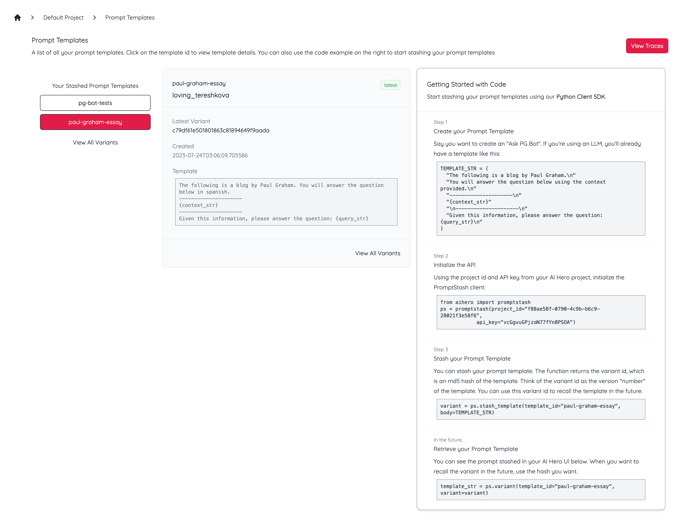
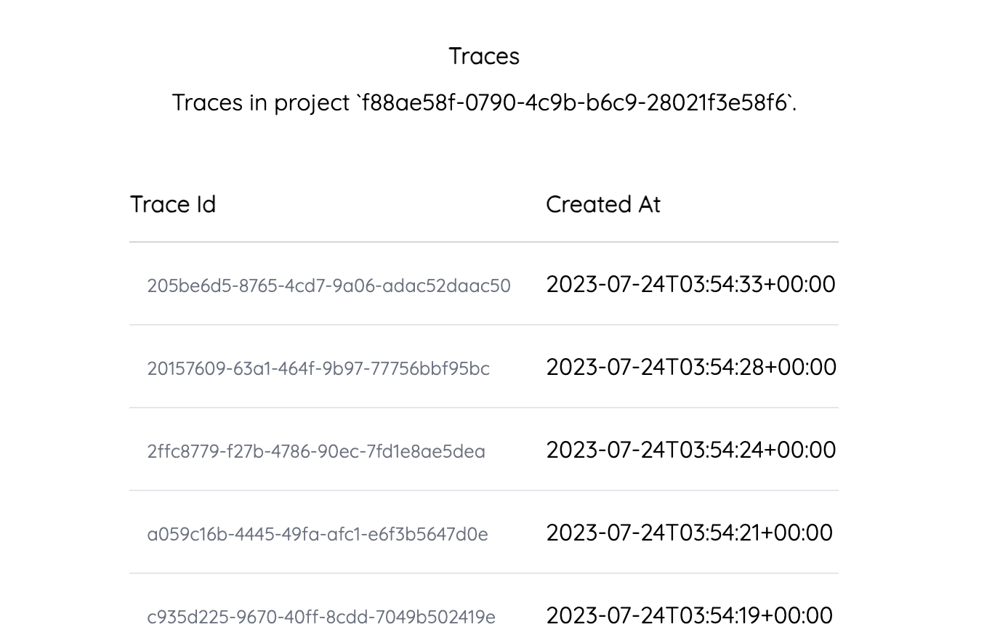
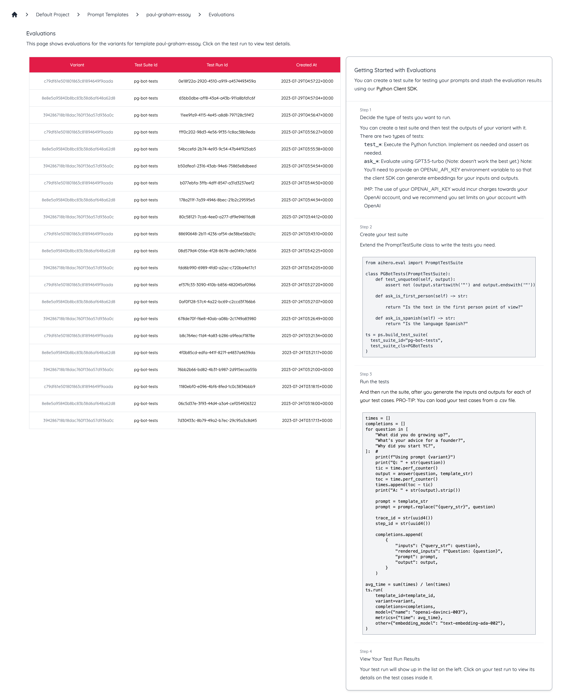
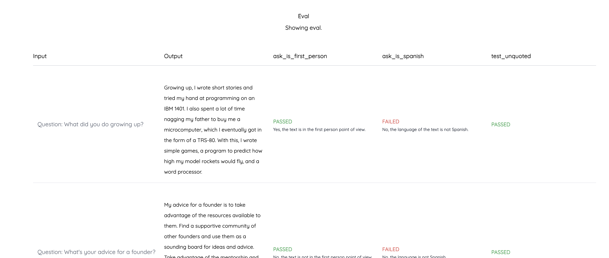

# AI Hero Python SDK
The AI Hero Python SDK offers a powerful set of tools for managing and developing AI models. With our latest release, you can easily manage prompt templates and versions, allowing for easier and more effective model development, testing, and deployment.

## Installation
Install AI Hero using pip:
```bash
pip install aihero==0.2.8
```


# PromptStash
In the rapidly evolving world of AI, the ability to manage and control versions of prompts becomes incredibly important. Much like software version control, prompt versioning allows developers to track changes, revert to previous versions, and implement updates in a controlled and systematic manner. This is especially useful when you want to recall previous versions of your AI model's prompt templates, perhaps for debugging, comparison or to manage different versions of an AI. That's where the concept of "Promptstash" in AI Hero Python SDK comes into play. 

## Tutorials
We have two tutorials for you:
- [PromptOps with OpenAI's Completions API + PromptStash (Beginner)](examples/PromptOps_with_OpenAI_Completions_API_+_PromptStash_(Beginner).ipynb) - In this example tutorial, we'll use an LLM to do some English to Japanese translation for us so that we can talk to our friend in Japanese and look at the PromptOps associated with it. [](https://colab.research.google.com/github/ai-hero/python-client-sdk/blob/main/examples/PromptOps_with_OpenAI_Completions_API_%2B_PromptStash_%28Beginner%29.ipynb)

- [PromptOps with OpenAI's Chat Completions API + PromptStash (Beginner)](examples/PromptOps_with_OpenAI_Chat_Completions_API_+_PromptStash_(Beginner).ipynb) - In this example tutorial, we'll use a LLM Chat Bot as a Japanese tutor for us so that we can learn Japanese through conversation and look at the PromptOps associated with it. [](https://colab.research.google.com/github/ai-hero/python-client-sdk/blob/main/examples/PromptOps_with_OpenAI_Chat_Completions_API_%2B_PromptStash_%28Beginner%29.ipynb)

There's more coming soon! 
- We're building a notebook for Retrieval Augmented Generation. 
- Hit us up if you'd like a custom demo at `team@aihero.studio`.

## Overview
As an example, let's say you want to create a "Ask PG (i.e. Paul Graham from YC) Bot". You'll already be using a template like this for Langchain, LlamaIndex, etc.
```python
TEMPLATE_STR = (
  "The following is a blog by Paul Graham.\n"
  "You will answer the question below using the context provided.\n"
  "---------------------\n"
  "{context_str}"
  "\n---------------------\n"
  "Given this information, please answer the question: {query_str}\n"
)
```

Let's create the promptstash instance ps using the project id and API key from the AI Hero. To get them you'll need to log into [https://app.aihero.studio] and create a project. Note your default project id and API key. 
```python
from aihero import promptstash
ps = promptstash(project_id="YOUR_PROJECT_ID", api_key="YOUR_API_KEY")
```

### Versioning and Stashing Prompt Templates
We can stash our current prompt template to get a "variant" id. A variant id is an MD5 hash of your prompt template. The `template_id` keeps all the variants for a prompt tempalte together.

```python
variant = ps.stash_template(template_id="paul-graham-essay", body=TEMPLATE_STR)
```

You can see the prompt stashed in your AI Hero UI. 



You can also see each variant of each prompt template stashed in your AI Hero UI. 


### Recalling Previously Stashed Templates

When you want to recall the variant in the future, use the hash you want.
```python
template_str = ps.variant(template_id="paul-graham-essay", variant=variant)
```

### Tracking Prompt Inputs and Outputs
You can also stash and visualize each prompt input and output for your variants. Assuming you have already created your promptstash ps object. For example, this is how you would stash it for a Q&A agent implemented using retrieval augmented generation.
```python
trace_id = str(uuid4())
step_id = str(uuid4())

ps.stash_completion(
    trace_id=trace_id,
    step_id=step_id,
    template_id="paul-graham-essay",
    variant=variant,
    prompt=prompt,
    output=output,
    inputs={"question": question},
    rendered_inputs=f"Question: {question}",
    model={"name": "openai-davinci-003", "version": date.today().strftime("%Y-%m-%d")},
    metrics={"time": (toc - tic)},
    other={"embedding_model": "text-embedding-ada-002"},
)
```

### Viewing Completions in Real Time

You can then view your stashed prompts in real-time from the UI.


NOTE: You'll need to provide an OPENAI_API_KEY environment variable so that the client SDK can generate embeddings for your inputs and outputs. This would incur charges for OpenAI, and we recommend you set limits on your account within OpenAI's [Playground](https //beta.openai.com/playground).
```python
import os
os.environ["OPENAI_API_KEY"]="YOUR_API_KEY"
```

### Traces
You can observe the traces (that you tracked with `trace_id` and `step_id` above)
 


### Evaluation (early release)

You can create a test suite and then test the outputs of your variant with it. There are two types of tests:
- `test_*`: Execute the Python function. Implement as needed and assert as needed.
- `ask_*`: Evaluate using GPT3.5-turbo (Note: doesn't work the best yet.)

NOTE: You'll need to provide an OPENAI_API_KEY environment variable so that the client SDK can generate embeddings for your inputs and outputs. This would incur charges for OpenAI, and we recommend you set limits on your account within OpenAI's [Playground](https //beta.openai.com/playground).
```python
import os
os.environ["OPENAI_API_KEY"]="YOUR_API_KEY"
```

First, create the test suite.
```python
from aihero.eval import PromptTestSuite

class PGBotTests(PromptTestSuite):
    def test_unquoted(self, output):
        assert not (output.startswith('"') and output.endswith('"'))

    def ask_is_first_person(self) -> str:        
        return "Is the output in the first person point of view?"

    def ask_is_spanish(self) -> str:
        return "Is the output language Spanish?"

ts = ps.build_test_suite(test_suite_id="pg-bot-tests", test_suite_cls=PGBotTests)
```

Then, you can generate your putputs, and run the test suite on that variant and outputs.
```python
times = []
completions = []
for question in [
    "What did you do growing up?",
    "What's your advice for a founder?",
    "Why did you start YC?",
]:  #
    print(f"Using prompt {variant}")
    print("Q: " + str(question))
    tic = time.perf_counter()
    output = answer(question, template_str)
    toc = time.perf_counter()
    times.append(toc - tic)
    print("A: " + str(output).strip())

    prompt = template_str
    prompt = prompt.replace("{query_str}", question)

    completions.append(
        {
            "inputs": {"query_str": question},
            "rendered_inputs": f"Question: {question}",
            "prompt": prompt,
            "output": output,
        }
    )

avg_time = sum(times) / len(times)
ts.run(
    template_id=template_id,
    variant=variant,
    completions=completions,
    model={"name": "openai-davinci-003"},
    metrics={"time": avg_time},
    other={"embedding_model": "text-embedding-ada-002"},
)
```

You can see the eval results in the UI.
 
 

### Record Feedback
You can record feedback from your user using the same trace_id and addinng your user feedback.
```python
step_id = str(uuid4())
ps.stash_feedback(
    trace_id=trace_id,
    step_id=step_id,
    thumbs_up=True,
    thumbs_down=False,
    correction="Foo",
    annotations={"user": "a"},
    other={"embedding_model": "text-embedding-ada-002"},
)
```
