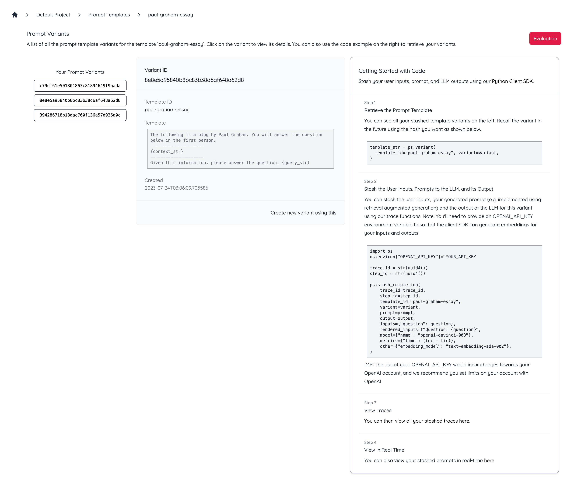
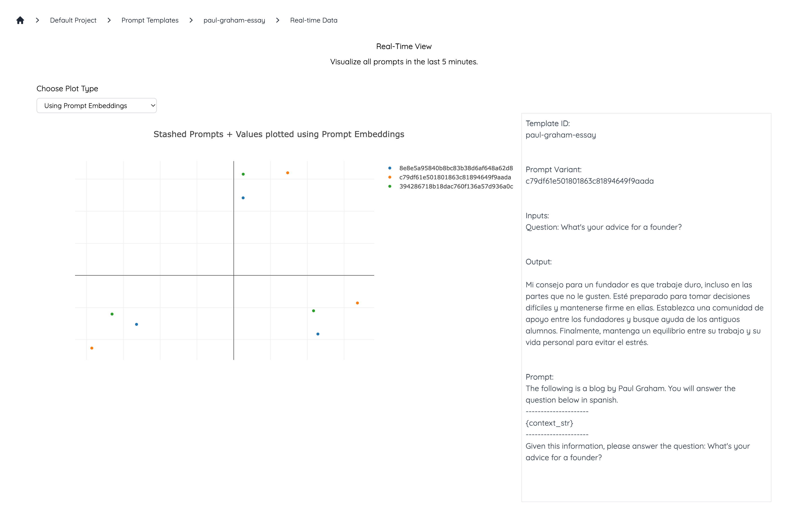

# AI Hero Python SDK
The AI Hero Python SDK offers a powerful set of tools for managing and developing AI models. With our latest release, you can easily manage prompt templates and versions, allowing for easier and more effective model development, testing, and deployment.

## Installation
Install AI Hero using pip:
```bash
pip install aihero==0.2.6
```

## Prompt Versioning
In the rapidly evolving world of AI, the ability to manage and control versions of prompts becomes incredibly important. Much like software version control, prompt versioning allows developers to track changes, revert to previous versions, and implement updates in a controlled and systematic manner. This is especially useful when you want to recall previous versions of your AI model's prompt templates, perhaps for debugging, comparison or to manage different versions of an AI. That's where the concept of "Promptstash" in AI Hero Python SDK comes into play. 

As an example, let's say you want to create a "Ask PG (i.e. Paul Graham from YC) Bot". You'll already be using a template like this for Langchain, LlamaIndex, etc.
```python
TEMPLATE_STR = (
      "The following is a blog by Paul Graham. You will answer the question below using the context provided.\n"
      "---------------------\n"
      "{context_str}"
      "\n---------------------\n"
      "Given this information, please answer the question: {query_str}\n"
  )
```

Let's create the promptstash instance ps using the project id and API key from the AI Hero. To get them you'll need to log into [https://app.aihero.studio] and create a project. Note your default project id and API key. 
```python
from aihero import promptstash
ps = promptstash(project_id="YOUR_PROJECT_ID", api_key="YOUR_API_KEY")
```

### Versioning and Stashing Prompt Templates
We can stash our current prompt template to get a "variant" id. A variant id is an MD5 hash of your prompt template. The `template_id` keeps all the variants for a prompt tempalte together.

```python
variant = ps.stash_template(template_id="paul-graham-essay", body=TEMPLATE_STR)
```

You can see the prompt stashed in your AI Hero UI. 



When you want to recall the variant in the future, use the hash you want.
```python
template_str = ps.variant(template_id="paul-graham-essay", variant=variant)
```

### Tracking Prompt Inputs and Outputs
You can also stash and visualize each prompt input and output for your variants. Assuming you have already created your promptstash ps object. For example, this is how you would stash it for a Q&A agent implemented using retrieval augmented generation.
```python
prompt_hash = ps.stash_completion(
    template_id="paul-graham-essay", variant=variant, 
    inputs=f"Question: {QUESTION}", prompt=prompt, output=output, 
    trace_id=str(uuid4()) # optional
)
```

You can then view your stashed prompts in real-time from the UI.



NOTE: You'll need to provide an OPENAI_API_KEY environment variable so that the client SDK can generate embeddings for your inputs and outputs. This would incur charges for OpenAI, and we recommend you set limits on your account with OpenAI.
```python
import os
os.environ["OPENAI_API_KEY"]="YOUR_API_KEY"
```

With these steps, you are well-equipped to manage prompt versioning effectively, ensuring that your AI model development and deployment processes are smooth, controlled, and efficient.

